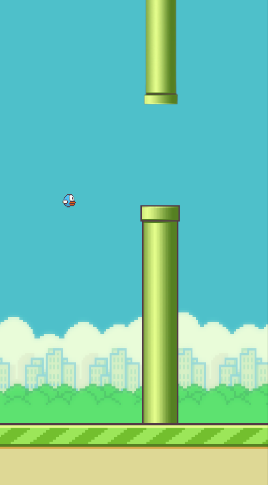
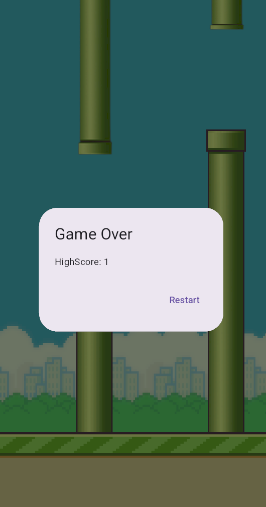

# Flappy Bird Clone 🎮  

A simple Flappy Bird replica built using the **Flame Engine** in Flutter. This game features smooth **sprite animations**, a **score tracking system**, and an engaging gameplay experience just like the original Flappy Bird.  

## Features 🚀  
- **Smooth Sprite Animation**: The bird flaps its wings using sprite-based animation for a realistic effect.  
- **Physics-Based Gameplay**: The game incorporates gravity and collision detection for a challenging experience.  
- **Score Tracking**: Keeps track of your last score so you can aim for a higher one.  
- **Endless Runner**: The game continues until the player collides with an obstacle.  
- **Replica of Flappy Bird**: Enjoy a nostalgic experience with the same mechanics as the original game.  

## Screenshots 📸  
### Game Start  
  

### Gameplay + Score
  

## How to Play 🎯  
- Tap anywhere on the screen to make the bird flap.  
- Avoid obstacles and keep the bird in the air.  
- Try to beat your last score!  

## Built With 🛠️  
- **Flutter** for cross-platform development.  
- **Flame Engine** for game mechanics and physics.  
- **Sprite Animation** for realistic movement effects.  

